# MQTT Station — Gửi bản tin & file nhạc qua MQTT

Ứng dụng **Next.js** (App Router + TypeScript + Tailwind) gồm:

- **FE**: giao diện web có nút upload file nhạc + form gửi bản tin text.
- **BE**: API routes nhận request từ FE, xử lý rồi **publish lên MQTT broker**.
- **MQTTX Web**: web client MQTT (connect/subscribe/publish trên browser) cho bên nhúng/QA.
- **Thiết bị nhúng**: subscribe topic MQTT, nhận bản tin/URL file, tải file và phát.

```
┌─────────┐    HTTP POST     ┌──────────┐     MQTT publish     ┌──────────────┐
│   FE    │ ───────────────▶ │ BE (Next)│ ───────────────────▶ │ MQTT Broker  │
│ (web UI)│                  │ API route│                      │   (EMQX)     │
└─────────┘                  └──────────┘                      └──────┬───────┘
                                                                      │ mqtts://:8883
                                                                      ▼
                                                               ┌──────────────┐
                                                               │ Thiết bị nhúng│
                                                               │ (ESP32/RTOS) │
                                                               └──────────────┘
```

## Luồng hoạt động (device activation + gửi file theo thiết bị)

```mermaid
flowchart TD
    %% =========================
    %% LUỒNG 1: KÍCH HOẠT THIẾT BỊ LẦN ĐẦU
    %% =========================
    subgraph FIRST["1. Kích hoạt thiết bị lần đầu"]
        A1[Bo mạch được nạp Firmware lần đầu] --> B1[Bo mạch khởi động]
        B1 --> C1[Kết nối Internet<br/>WiFi / LAN / 4G]
        C1 --> D1["Gọi Backend qua HTTPS<br/>POST /api/iot/activate"]
        D1 --> E1["Gửi thông tin kích hoạt<br/>deviceId + activationCode"]
        E1 --> F1[Backend nhận yêu cầu kích hoạt]
        F1 --> G1{deviceId có tồn tại?}
        G1 -- Không --> X1[Từ chối kích hoạt 403]
        G1 -- Có --> H1{activationCode hợp lệ?}
        H1 -- Không --> X1
        H1 -- Có --> I1{activationCode đã sử dụng?}
        I1 -- Có --> X1[409]
        I1 -- Chưa --> J1[Backend xác nhận thiết bị hợp lệ]
        J1 --> K1["Backend tạo MQTT Credential<br/>username = deviceId<br/>password random"]
        K1 --> L1["Backend đăng ký credential<br/>với EMQX qua Management API"]
        L1 --> M1[Đánh dấu activationCode = USED]
        M1 --> N1["Backend trả về IoT<br/>mqttHost / mqttPort:8883 / username / password"]
        N1 --> O1[IoT lưu MQTT Credential]
        O1 --> P1["IoT kết nối MQTT qua TLS<br/>mqtts://host:8883"]
        P1 --> Q1[MQTT CONNECT<br/>username + password]
        Q1 --> R1{EMQX xác thực thành công?}
        R1 -- Không --> Y1[Từ chối kết nối MQTT]
        R1 -- Có --> S1[MQTT Connected]
        S1 --> T1["IoT Subscribe<br/>station/player/device/ID/command"]
        T1 --> U1["IoT Publish trạng thái định kỳ<br/>station/player/device/ID/status"]
        U1 --> V1[BE cập nhật lastSeenAt → ONLINE]
        V1 --> W1[Website hiển thị thiết bị Online]
    end

    %% =========================
    %% LUỒNG 2: GỬI FILE ÂM THANH
    %% =========================
    subgraph AUDIO["2. Website gửi file âm thanh xuống IoT"]
        A2[Website upload file MP3 + chọn thiết bị] --> B2[Backend nhận file]
        B2 --> C2["Kiểm tra file<br/>định dạng + dung lượng<br/>tạo SHA256"]
        C2 --> D2[Lưu file vào storage private]
        D2 --> E2["Backend publish MQTT command<br/>fileId + sha256 + action<br/>topic riêng của thiết bị"]
        E2 --> F2[Thiết bị IoT nhận MQTT]
        F2 --> G2[Xác minh danh tính thiết bị]
        G2 --> G21{Credential hợp lệ?}
        G21 -- Không --> X2[Bỏ qua lệnh]
        G21 -- Có --> I2["IoT gọi POST /api/iot/token<br/>đổi credential lấy Access + Refresh Token"]
        I2 --> J2[IoT gọi API tải file]
        J2 --> K2["GET /api/files/:fileId<br/>Authorization: Bearer AccessToken"]
        K2 --> L2[Backend verify Access Token]
        L2 --> M2{Thiết bị có quyền tải file?}
        M2 -- Không --> N2[403 Forbidden]
        M2 -- Có --> O2[Backend trả file qua HTTPS]
        O2 --> P2[IoT tải file]
        P2 --> Q2[IoT tính SHA256 file]
        Q2 --> R2{SHA256 khớp Backend?}
        R2 -- Không --> S2[Xóa file / Báo lỗi]
        R2 -- Có --> T2[Phát file âm thanh]
        T2 --> U2["IoT publish trạng thái qua MQTT<br/>DOWNLOADED / PLAYING / DONE"]
    end

    %% Nối 2 luồng
    W1 --> A2
```



> So với luồng cũ: file **không còn tải public** qua `GET /api/files/:id` — mọi download
> bắt buộc có Access Token do BE cấp sau khi xác thực credential của thiết bị, và chỉ
> thiết bị được chỉ định (`sentTo`) mới có quyền tải.

## Cài đặt & chạy

### Cách 1 — Full stack với Docker (broker + app, 1 lệnh)

```bash
nano .env                       # điền mật khẩu thật (openssl rand -base64 24)
docker compose up -d --build
```

Password user MQTT nằm hoàn toàn trong `.env` (không commit): mỗi lần deploy,
service `emqx-init` tự gọi EMQX API tạo/cập nhật user từ `MQTT_APP_PASSWORD`
(web-backend, superuser) và `MQTT_DEVICE_PASSWORD` (device-01, device-02).

> **Trên Dokploy:**
> - Không cần file `.env` — paste biến vào tab **Environment** của service (tùy chọn, compose có default).
> - App **không publish port** ra host (tránh đụng port 3000 của Dashboard Dokploy) — truy cập qua
>   **Domains** tab: thêm domain, port `3000`, service `app`, HTTPS Let's Encrypt. App đã join
>   `dokploy-network` sẵn trong compose.
> - Chạy ngoài Dokploy (VPS thuần): uncomment dòng ports 3000 trong compose và xóa
>   `dokploy-network` nếu chưa có.

→ App: `http://localhost:3000` · Dashboard EMQX: `ssh -L 18083:127.0.0.1:18083 <vps>` rồi mở `http://localhost:18083`

### Cách 2 — Dev local (app chạy npm, broker ngoài)

```bash
npm install
cp .env.example .env.local   # chỉnh MQTT_URL nếu cần (file .env ở root dành cho compose)
npm run dev                  # http://localhost:3000
```

Mặc định dùng broker public `ws://broker.emqx.io:8083/mqtt` để test nhanh.
Production nên đổi sang broker riêng (EMQX, HiveMQ, Mosquitto...).

### Deploy production lên Dokploy

Xem `deploy/app/README.md` (app) và `deploy/emqx/README.md` (broker) — khuyến nghị
deploy 2 service riêng để redeploy app không restart broker.

## MQTTX Web — giao diện MQTT client cho bên nhúng/QA

Compose đã kèm **MQTTX Web** (`emqx/mqttx-web`) — web client MQTT chính thức của EMQX,
chạy trên browser: connect, subscribe, publish không cần cài gì.

**Setup 1 lần trên Dokploy:**

1. Deploy lại compose (có service mới `mqttx-web`).
2. Service → **Domains** → **Add Domain** thứ 2:
   - Domain: `mqtt-client.<domain>` (DNS A record → VPS)
   - Service Name: chọn `mqttx-web`
   - Container Port: `80` (MQTTX Web là static web, chạy port 80 trong container)
   - HTTPS: bật

**Bên nhúng dùng:**

1. Mở `https://mqtt-client.<domain>`
2. **New Connection**:
   - Host: `ws://<IP-VPS>` · Port: `8083` (WebSocket — browser không nối TCP 1883 được)
   - Username: `device-01` · Password: giá trị `MQTT_DEVICE_PASSWORD` trong `.env` (mặc định `123123`)
3. Subscribe `station/player/#` → nhận bản tin + URL tải file nhạc realtime
4. Publish thử lên `station/player/control` nếu thiết bị có xử lý lệnh điều khiển

> WS listener 8083 đã bật sẵn trong compose (`EMQX_LISTENERS__WS__DEFAULT__BIND`).
> Nếu muốn qua HTTPS domain riêng cho broker: dùng `wss://` + port 443 qua Traefik (cần TLS cert).

## Biến môi trường (`.env.local`)

| Biến | Ý nghĩa | Mặc định |
|---|---|---|
| `MQTT_URL` | URL broker (ws/wss/mqtt/tcp) | `ws://broker.emqx.io:8083/mqtt` |
| `MQTT_USERNAME` | Tên đăng nhập (nếu có) | — |
| `MQTT_PASSWORD` | Mật khẩu (nếu có) | — |
| `MQTT_CLIENT_ID_PREFIX` | Tiền tố client ID | `web-uploader` |
| `MQTT_TOPIC_BASE` | Gốc của các topic | `station/player` |
| `APP_PUBLIC_URL` | Domain public của app để tạo URL tải file | tự suy ra từ request |

## API

| Method | Endpoint | Body / Auth | Mô tả |
|---|---|---|---|
| `POST` | `/api/iot/devices` | JSON `{ deviceId, code? }` | **Admin** đăng ký thiết bị mới + sinh mã kích hoạt |
| `GET` | `/api/iot/devices` | — | Danh sách thiết bị + trạng thái online |
| `POST` | `/api/iot/devices/:id/reprovision` | JSON `{ code? }` | **Admin** cấp lại mã kích hoạt khi thiết bị mất credential (thu hồi token cũ) |
| `POST` | `/api/iot/devices/:id/control` | JSON `{ action, volume?, repeat?, fileId?, positionSeconds? }` | Điều khiển âm lượng, lặp lại, tua, tạm dừng/tiếp tục, bài tiếp/bài trước cho thiết bị đã kích hoạt và online |
| `POST` | `/api/iot/activate` | JSON `{ deviceId, activationCode, firmwareVersion? }` | Thiết bị kích hoạt — trả MQTT credential (1 lần duy nhất); tự động ghi ACL per-topic |
| `POST` | `/api/iot/token` | JSON `{ deviceId, mqttPassword, fileId? }` | Thiết bị đổi credential lấy CẶP token: accessToken TTL 10 phút + refreshToken TTL 30 ngày |
| `POST` | `/api/iot/token/refresh` | JSON `{ deviceId, refreshToken }` | Đổi refresh token lấy cặp token mới (rotation — refresh dùng 1 lần rồi chết) |
| `POST` | `/api/upload` | FormData `file=<File>` + `deviceId=<id>` | Upload file và gửi lệnh tải tới 1 thiết bị qua MQTT |
| `GET` | `/api/files/:id` | Header `Authorization: Bearer <accessToken>` | Tải file — **bắt buộc token**, chỉ device được chỉ định |
| `POST` | `/api/announcement` | JSON `{ title, content, priority? }` | Publish bản tin text (luồng cũ, giữ tương thích) |
| `GET` | `/api/broker-status` | — | Kiểm tra kết nối broker |

## Hợp đồng MQTT cho bên nhúng (embedded)

Base topic: `station/player` (đổi qua `MQTT_TOPIC_BASE` nếu muốn).

### 0. Kích hoạt thiết bị (chạy 1 lần sau khi nạp firmware)

1. Admin tạo thiết bị trên web (hoặc `POST /api/iot/devices` với `{"deviceId":"SOMICS-000001"}`)
   → nhận mã kích hoạt dạng `XXXX-XXXX-XXXX`.
2. Firmware gọi `POST /api/iot/activate`:
   ```json
   { "deviceId": "SOMICS-000001", "activationCode": "ABCD-EFGH-JKMN", "firmwareVersion": "1.0.0" }
   ```
3. Response chứa credential **duy nhất 1 lần** — firmware phải lưu vào NVS/flash:
   ```json
   {
     "ok": true,
     "mqtt": {
       "mqttHost": "mqtt.example.com",
       "mqttPort": 8883,
       "mqttTls": true,
       "username": "SOMICS-000001",
       "password": "<random 24 bytes>",
       "commandTopic": "station/player/device/SOMICS-000001/command",
       "statusTopic": "station/player/device/SOMICS-000001/status"
     }
   }
   ```
4. Kết nối `mqtts://<mqttHost>:8883` (TLS, CA cert xem `deploy/emqx/README.md` mục 8),
   subscribe `commandTopic`, publish status định kỳ ≤ 60s/lần vào `statusTopic`:
   ```json
   { "deviceId": "SOMICS-000001", "state": "IDLE", "uptime": 12345 }
   ```
   State gợi ý: `IDLE`, `DOWNLOADED`, `PLAYING`, `DONE`, `ERROR`. BE coi thiết bị
   ONLINE nếu có status trong 2 phút gần nhất.
5. Nhận lệnh file qua `commandTopic`:
   ```json
   { "type": "file", "action": "download", "fileId": "uuid", "fileName": "bai-hat.mp3",
     "size": 1048576, "sha256": "hex", "tokenEndpoint": "/api/iot/token",
     "refreshEndpoint": "/api/iot/token/refresh",
     "downloadEndpoint": "/api/files/<uuid>" }
   ```
6. Lần đầu tải file: `POST /api/iot/token` với `{"deviceId":"...","mqttPassword":"...","fileId":"..."}`
   → nhận **cặp token**:
   ```json
   {
     "ok": true,
     "accessToken": "...",      // TTL 10 phút — dùng tải file
     "refreshToken": "...",     // TTL 30 ngày — dùng đổi cặp mới
     "tokenType": "Bearer",
     "expiresIn": 600,
     "refreshExpiresIn": 2592000,
     "refreshEndpoint": "/api/iot/token/refresh"
   }
   ```
   → `GET /api/files/<uuid>` kèm `Authorization: Bearer <accessToken>`
   → kiểm tra SHA256 sau khi tải → phát → publish status `DOWNLOADED/PLAYING/DONE`.
7. Khi accessToken hết hạn: `POST /api/iot/token/refresh` với
   `{"deviceId":"...","refreshToken":"..."}` → nhận cặp token mới.
   **Refresh token dùng 1 lần rồi chết (rotation)** — cặp mới trả về thay thế cặp cũ.
   Không cần gửi lại mqttPassword. Refresh token hết hạn (30 ngày) hoặc bị mất
   thì quay lại bước 6 (login bằng credential).

### 0.1 Điều khiển phát nhạc trên website

Chọn một thiết bị đã kích hoạt và online trong **Thiết bị nhận** để hiện thanh
điều khiển: âm lượng 0–100%, nút giảm/tăng 5%, tạm dừng/tiếp tục, bài trước,
bài tiếp, bật/tắt lặp lại bài hiện tại và thanh tua kèm thời gian đã phát/tổng
thời lượng. Khi thiết bị offline, thanh điều khiển được ẩn ở lần cập nhật danh sách
kế tiếp; API cũng kiểm tra heartbeat trong 2 phút gần nhất trước khi gửi lệnh.

`POST /api/iot/devices/SOMICS-000001/control` với `{"action":"set_volume","volume":70}`
publish lên **commandTopic riêng của thiết bị**, QoS 1, không retained:

```json
{
  "id": "uuid",
  "type": "control",
  "action": "set_volume",
  "volume": 70,
  "sentAt": "2026-10-07T02:00:00.000Z"
}
```

| `action` | Xử lý trong firmware |
| --- | --- |
| `set_volume` | Đặt âm lượng tuyệt đối theo `volume` (số nguyên 0–100) |
| `pause` | Tạm dừng bài đang phát |
| `resume` | Tiếp tục bài đã tạm dừng |
| `next` | Chuyển đến bài tiếp theo trong danh sách trên thiết bị |
| `previous` | Quay về bài trước trong danh sách trên thiết bị |
| `set_repeat` | `repeat: "one"` lặp lại bài hiện tại, `repeat: "off"` tắt lặp lại |
| `seek` | Tua bài `fileId` tới `positionSeconds` (giây, cho phép số thập phân); giữ nguyên trạng thái phát/tạm dừng |

Ví dụ body lặp lại: `{"action":"set_repeat","repeat":"one"}`.
Ví dụ body tua: `{"action":"seek","fileId":"<uuid bài đang phát>","positionSeconds":75.5}`.
BE kiểm tra file đang phát, trạng thái `PLAYING`/`PAUSED` và giới hạn thời lượng
trước khi publish; firmware cũng phải kiểm tra `fileId` còn khớp bài hiện tại
khi nhận lệnh để không tua nhầm bài sau khi chuyển bài.

BE đọc thời lượng bằng `music-metadata` khi upload, lưu `durationSeconds` vào
metadata file và gửi kèm lệnh `download`/response upload. Nếu không đọc được,
giá trị là `null`; firmware có thể báo lại thời lượng từ bộ giải mã. Không gán
thời lượng của file vừa upload cho một bài khác đang phát.

Firmware publish vào **statusTopic** khi bắt đầu phát, tua, chuyển bài, tạm dừng,
đổi lặp lại/âm lượng, và mỗi 1–2 giây khi đang phát:

```json
{
  "deviceId": "SOMICS-000001",
  "state": "PLAYING",
  "fileId": "11111111-1111-4111-8111-111111111111",
  "fileName": "bai-hat.mp3",
  "durationSeconds": 210.5,
  "positionSeconds": 75.5,
  "repeat": "one",
  "volume": 70
}
```

`fileId` dùng UUID đã nhận trong lệnh download. `state` hỗ trợ `PAUSED` và các
trạng thái cũ (`IDLE`, `DOWNLOADED`, `PLAYING`, `DONE`, `ERROR`). Vị trí/thời
lượng dùng **giây**, không phải millisecond. Khi hết bài, publish `DONE`; khi
không còn bài, publish `IDLE` hoặc `fileId: null`. Khi lặp lại, báo vị trí mới
quay về 0. BE lưu trạng thái trong registry để mở lại web vẫn thấy bài hiện tại;
nếu firmware chỉ báo `fileId`, BE lấy tên/thời lượng từ metadata file của đúng
thiết bị. File cũ chưa có metadata thời lượng cần firmware báo `durationSeconds`.

Website cập nhật trạng thái mỗi 2 giây khi chọn thiết bị, nội suy vị trí giữa
các status chỉ khi `PLAYING`, dừng đồng hồ khi `PAUSED` và không vượt tổng
thời lượng. Kéo thanh xem trước vị trí; thả chuột/chạm hoặc dùng phím điều hướng
để gửi một lệnh tua. Thanh tua bị vô hiệu hóa khi chưa biết bài/thời lượng hoặc
khi bài đã kết thúc. Nút lặp lại sáng khi bật và có thể bấm lại để tắt.

Firmware cần xử lý các action này, dedupe theo `id` vì QoS 1 có thể gửi lại,
và có danh sách bài để chuyển bài. Website báo **đã gửi lệnh** khi broker nhận
lệnh; trạng thái phát thực tế được cập nhật từ status của firmware. Không tự
gửi lệnh khi chọn thiết bị. Âm lượng khởi tạo ở 50% khi chưa nhận `volume`.

Kiểm tra logic thời lượng/vị trí bằng `npm test` (Node.js 22.18+), build bằng `npm run build`.

### 0.2 ACL — giới hạn topic cho từng thiết bị

Khi kích hoạt (lần đầu hoặc re-provision), backend tự ghi ACL vào authorizer
`built_in_database` của EMQX cho từng device user:

- **Cho phép** subscribe `station/player/device/<ID>/command`
- **Cho phép** publish `station/player/device/<ID>/status`
- **Mọi topic khác bị từ chối** (EMQX deny mặc định khi không khớp rule allow nào)

Nhờ vậy thiết bị A không thể nghe lệnh của thiết bị B hay giả mạo status của nhau.
Yêu cầu: authorizer `built_in_database` phải tồn tại — backend tự tạo qua API
(`ensureBuiltInAuthzSource`) nếu chưa có.

### 0.3 Re-provision — thiết bị mất credential

Khi thiết bị bị mất credential (flash xóa, firmware reset...):

1. Admin bấm **"Cấp lại mã"** trên web (hoặc `POST /api/iot/devices/<ID>/reprovision`):
   - Thu hồi mọi mã chờ cũ của thiết bị (chỉ 1 mã active tại 1 thời điểm)
   - Sinh mã kích hoạt mới + thu hồi ngay mọi access token chưa hết hạn
2. Đưa mã mới cho bên nhúng nạp vào firmware.
3. Thiết bị gọi lại `POST /api/iot/activate` như lần đầu — PUT user trên EMQX
   **override password cũ** → credential cũ chết ngay lập tức, device kết nối lại
   với credential mới, ACL được ghi lại.

> Thiết bị **không** activate lại thì credential cũ vẫn đăng nhập được broker
> (vẫn hợp lệ trên EMQX). Nếu nghi bị mất cắp credential chứ không chỉ mất cục bộ,
> hãy dùng Dashboard EMQX xóa tay user đó trước khi cấp lại mã.

### Kết nối từ thiết bị nhúng

- Trong mạng tin cậy: `mqtt://<VPS>:1883`
- Qua Internet (khuyến nghị): `mqtts://<VPS>:8883` (TLS) — xem `deploy/emqx/README.md` mục 8 để tạo chứng chỉ bằng `deploy/emqx/certs/gen-certs.sh`

### 1. `station/player/announcement` (JSON, QoS 1)

```json
{
  "type": "announcement",
  "id": "uuid",
  "title": "Tiêu đề",
  "content": "Nội dung thông báo",
  "priority": "normal",
  "sender": "web-frontend",
  "createdAt": "2026-09-30T09:00:00.000Z"
}
```

### 2. `station/player/file/available` (JSON, QoS 1)

Khi upload file nhạc, BE lưu file trên web server rồi publish JSON chứa URL tải file:

```json
{
  "type": "file",
  "delivery": "http",
  "id": "uuid",
  "fileName": "bai-hat.mp3",
  "mimeType": "audio/mpeg",
  "size": 1048576,
  "sha256": "hex_sha256",
  "downloadUrl": "https://station.example.com/api/files/uuid",
  "uploadedAt": "2026-09-30T09:00:00.000Z"
}
```

Thiết bị subscribe `station/player/#`, khi nhận `type=file` thì HTTP GET `downloadUrl`,
kiểm tra `sha256` nếu cần, rồi phát/lưu file.
Message file này được publish dạng retained, nên thiết bị kết nối sau vẫn nhận được
file mới nhất ngay khi subscribe.

### 3. `station/player/control` (JSON, tùy chọn)

Đặt lệnh điều khiển phát: `{ "action": "play" | "stop" | "skip", ... }`.

## Ghi chú kỹ thuật

- **MQTT client singleton**: BE giữ 1 kết nối dài hạn tới broker, chia sẻ cho mọi API routes, tự reconnect mỗi 5s khi broker restart/mất mạng (xem `src/lib/mqtt.ts`). Cache trên `globalThis` để an toàn với hot-reload của Next.js dev.
- QoS 1 đảm bảo message đến ít nhất 1 lần; bên nhúng nên dedupe bằng `id`.
- MQTT broker không lưu lịch sử message thường. `station/player/file/available` dùng retained message để subscriber mới nhận file mới nhất; các announcement cũ chỉ hiện trong history local của MQTTX.
- File lớn hơn 20MB bị từ chối ở cả FE lẫn BE.
- Set `APP_PUBLIC_URL=https://<domain-app>` khi deploy để `downloadUrl` là URL public cho thiết bị nhúng. Nếu bỏ trống, app tự suy ra từ request upload.
